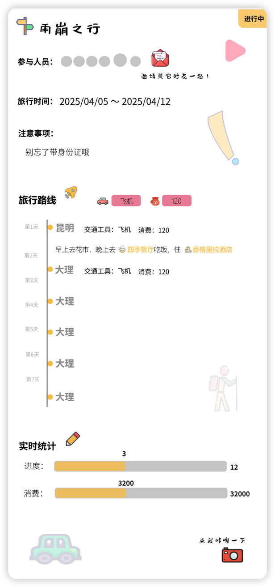

# APP描述

APP简介口号：开启一场不一样的旅行...

APP作用： 

1. 帮助用户在旅行前制作攻略，规划路线，消费，交通等
2. 提供旅行社交功能，用户可以查找周围正在使用该APP的用户，具有添加好友，邀请加入旅行等功能
3. 可以对其它用户发起旅行邀请，添加旅行伙伴，加入旅程的用户也可以编辑该旅行攻略，即一起协作制作攻略。

# 设计模型

## 主题色

## 字体样式

## 登录页

## 注册页

## 首页

未登录态：引导用户注册登录

登录态：没有正在进行的旅行攻略时，展示用户主动设置的旅行攻略，没有主动设置，则引导用户开始或计划旅行

## 攻略详情

包括参与人员，旅行时间，注意事项，行程安排，费用预算等。里面包括邀请旅游伙伴，分享行程的功能

## 发现

展示攻略列表

里面是用户发表公布的攻略列表，顶部包括搜索框和筛选按钮，用户可以通过搜索关键词和筛选条件来查找攻略

## 我的

未登录态：引导用户注册登录

登录态： 包括用户信息，用户发布的攻略以及用户收藏的攻略

